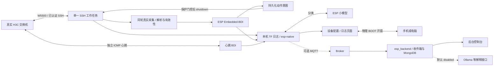
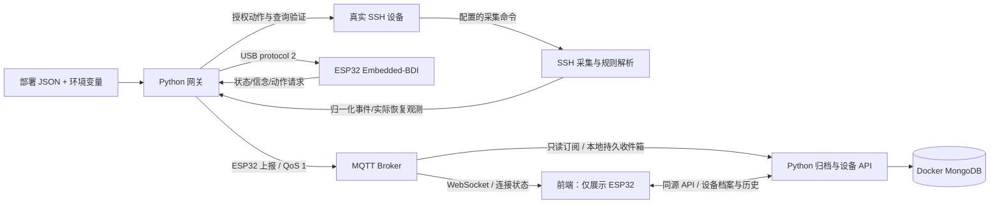

# ESP 独立运行与可选后台架构

正式构建为 `esp32-s3-devkitc-1`。设备固件、软件后台和前端有独立边界：现场采集、BDI、动作验证、TF 日志与小模型都在 ESP 完成；后台只接收上报并提供历史与附加解释。USB 不参与正式运行链路。

```mermaid
flowchart LR
  SW[真实 H3C 交换机] <-->|W5500 / 已认证 SSH| SSH[单一 SSH 工作任务]
  SSH --> OBS[同轮真实采集 / 解析与有效性]
  OBS --> BDI[ESP Embedded-BDI]
  BDI --> LEDGER[持久化动作意图]
  LEDGER -->|保护门控后 shutdown| SSH
  SW <-->|独立 ICMP 心跳| HB[心跳 BDI]
  SSH --> LOG[本机 TF 日志 / esp-native]
  BDI --> LOG
  HB --> LOG
  LOG <-->|分类| AI[ESP 小模型]
  LOG --> WEB[设备配置 / 日志页面]
  WEB <-->|物理 BOOT 开窗| PHONE[手机或电脑]
  LOG -. 可选 MQTT .-> BROKER[Broker]
  BROKER --> BACK[esp_backend / 收件箱与 MongoDB]
  BACK --> FRONT[后台控制台]
  BACK -. 默认 disabled .-> PROVIDER[Ollama 等解释接口]
```

## 三层职责

| 层 / 路径 | 职责 |
| --- | --- |
| `src/main.cpp` | 仅组装正式固件组件并调度；状态机由主循环单线程推进，不包含 USB 运行时分支 |
| `src/config/` | 板级与模式设置、网络/SSH/MQTT 参数、统一设置校验 |
| `src/device/` | 独立 BOOT 采样、长按配置/三击日志、十分钟窗口、HTTP 与按需 BLE |
| `src/net/` | SSH 独占工作任务、命令白名单、ICMP、可选网口 MQTT 与发布游标 |
| `src/security/` | 主机公钥首次配对、按目标持久信任与换钥阻止登录 |
| `src/bdi/` | 实际心跳 BDI 的信念、目标与计划；不据此清除业务故障 |
| `src/h3c/` | 真实命令解析、同轮新鲜证据、H3C Embedded-BDI、持久化动作账本与处置后验证 |
| `src/storage/` | 原生报告、PSRAM 队列、独占 TF 任务和 NVS 文本持久化适配 |
| `src/common/` | 统一事件出口、脱敏与日志文本等公共辅助能力 |
| `src/ai/` | 本机推理、合格模型、设备分类服务；没有动作调用权限 |
| `src/generated/` | 从 `frontend/device/` 与 `shared/` 生成的页面头文件，不手动维护 |
| `src/legacy/` | 旧 USB 入口、归一化集群模型和 TF 数据库镜像，仅显式实验构建使用 |
| `esp_backend/` | 原生 MQTT 契约、持久收件箱、设备与历史 API、MongoDB、可选 AI provider |
| `frontend/device/` | 固件嵌入的设置与本机日志分析页面，无后台依赖 |
| `frontend/backend/` | 软件控制台，Model / View / Controller / Service 分工，只消费上报和 API |
| `frontend/shared/` | 两类前端共用的证据解释和呈现，不发送 SSH/MQTT 控制动作 |
| `esp_gateway/` | 历史 USB 主机网关测试兼容；不是正式固件的运行依赖 |

默认 PlatformIO `build_src_filter = +<main.cpp>` 只选正式入口；`esp32-s3-usb-lab` 改选 `+<legacy/main.cpp>`。旧 `esp32-s3-eth-mqtt-lab` 与 `esp32-s3-log-ai-lab` 保留为默认能力的兼容别名，正式功能不依赖它们。

部署用推理源码和权重为 `src/ai/inference.h`、`src/ai/model.h`；训练、语料及对照验证留在 `experiments/tiny_log_explainer/`。`tools/sync_log_model.py` 导出合格产物，`--check` 只检查一致性。正式宏 `ESP_LOG_AI_ENABLED` 默认 1。页面构建则由 `tools/embed_network_page.py` 生成 `src/generated/network_page.h`、`archive_page.h`；生成产物与原始模板同时校验，避免维护重复实现。

## 真实采集、决策与验证

自动轮询按固定顺序读取 `display version`、`display interface brief`、`display interface brief down`、`display loopback-detection`、`display stp brief`、`display link-aggregation verbose`、`display logbuffer reverse`、`display cpu-usage`、`display memory`。每项按实际完成时间标记 cycle 与目标版本，输出截断、未知格式、混轮、过期或切换目标均不能成为写操作的依据。手动查询复用同一串行 SSH 工作任务。

已确认支持的身份为现场 S5130S-52S-EI / R6328P03；其他身份保留只读。H3C BDI 和心跳 BDI 使用分离的信念与计划。真实环路处置要求 `loop_confirmed`、`action_allowed`、`ssh_ready` 同时满足，执行前再次核对证据。

业务口授权不能覆盖管理口 `GigabitEthernet1/0/1`、trunk/hybrid、聚合成员、STP ROOT/MAST、保护已激活或已限制转发的端口。策略只对明确且尚未隔离的环路形成四步命令：`system-view` → 指定接口 → `shutdown` → `return`。动作意图必须先持久化；持久化失败、会话边界不明或执行失败时不重放写命令。断电后保留认领记录，避免同一端口因重启再次盲目动作。

命令 ACK 与恢复是两类证据。至少两个不同的处置后完整采集周期同时确认 ADM 和管理关闭原因，才进入 `contained`。这只证明隔离，**不能声明物理环路已修复**。正式流程保留隔离等待现场修复，不自行 `undo shutdown`。策略模块的受控恢复能力要求原动作所有权、明确修复确认、当前保护门控与持续读回验证，不能用于恢复外部关闭或交换机保护的端口。

## BOOT、SSH 公钥与本机 AI

1. 上电读取 NVS。当前默认 ESP 为 `192.168.10.1/24`，目标 `192.168.10.2:22`；已保存参数优先。
2. 长按 BOOT 3 秒进入 `ESP-Config-…` 设置窗口，一次保存网口、SSH、MQTT；保存成功后三秒关闭，未保存十分钟关闭。
3. 首次 SSH 连接在发送密码前自动取得并保存主机公钥，之后重连校验。指纹只读显示，无需输入；换钥阻止登录。在可信现场长按开启配置页，明确点击重新配对才清当前目标旧公钥。接口本身不能远程打开物理配置窗口。
4. 连续短按 BOOT 三次进入 `ESP-Logs-…` 日志窗口。连接并访问 `http://192.168.4.1/archive`；热点会避开网口网段。只读窗口不提供配置写入。
5. 日志模型在 ESP 推理，页面结合原文与规则显示中文说明；未知、低置信度或阶段冲突时不采用模型结论。模型与后台 AI 都不能触发硬件动作。

SSH 首次登录后，心跳每五秒一次，连续三次失败告警、两次成功解除心跳告警，过期为 unknown。心跳成功不等于业务正常、SSH 会话有效或环路已修复。

## TF 原文、时间与可选 MQTT

新目录 `/esp-native` 只保存实际设备事件，包标注 `source=esp_native`、`transport=ETH`、`boot`、`clock=uptime`。原文时间保持 64 位单调运行时间，页面显示“本次开机 +…秒”；跨 boot 不混合关联。旧 `/esp-db-mirror` 和 `/esp-journal` 保留，不混入正式原生日志。

固定 PSRAM 队列 96 条，每条最多约 1 KiB；每 30 秒或读取时请求提交，单包最多 64 条、约 48 KiB。TF 独占任务临时写入后重命名，约 12 MiB、最多 256 包循环保留并预留约 1 MiB。断电可能丢失未提交记录；卡异常不阻塞采样，缺口明确报告。动作意图账本独立于日志展示；意图持久化不可用时，自动动作不能继续执行。

MQTT 默认关闭，启用后使用 `esp-switch/<设备ID>/status`、`report`、`availability`。已提交 TF 报告以 QoS 1 发送，只有匹配 PUBACK 才前进游标；断线后可补发仍在 TF 保留窗口内的报告，超出循环窗口的记录不能承诺找回。状态/Last Will 与报告分别处理，不重复复制 USB 数据。

后台以 [`config/native.json`](../config/native.json) 连接 Broker，无串口配置依赖。`esp_backend` 的持久收件箱解耦 MQTT 与 MongoDB；原生 report 不改写 uptime，数据库外层 `archive_at_ms` 表示接收归档时间。前端 retained 消息只恢复内容，不单凭重收消息刷新在线。缺后台或 Broker 不影响本机采集、分析和 BDI。

后台 AI provider 默认 `ESP_AI_PROVIDER=disabled`。可选 `ollama` 或 `openai-compatible`，另配模型和地址，只读取有界归档证据，解释结果带 provider 来源。它不是 ESP 模型的替代，也没有 SSH 执行器或 MQTT 控制通道。

## 改版前独立固件验收记录（2026-11-02）

默认独立固件已编译、烧录并通过写入哈希校验。41 项页面与证据关联测试通过；本机报告的容量、脱敏、UTF-8 和单调时间通过 ASan/UBSan 测试；实际 BDI 心跳计划测试通过，小模型 55 项 Python/C++ 对照与内存检查通过。用户已手动确认 BOOT/Wi-Fi 页面和连接恢复。电脑自动连接热点未能找到该 SSID，故本轮未完成自动 Wi-Fi HTTP 验收；不将手动确认扩大为已完成所有接口或存储耐久验收。

---

# 历史主机网关架构（开发与迁移参考）

```mermaid
flowchart LR
  C[部署 JSON + 环境变量] --> G[Python 网关]
  D[真实 SSH 设备] -->|配置的采集命令| S[SSH 采集与规则解析]
  S -->|归一化事件/实际恢复观测| G
  G -->|USB protocol 2| E[ESP32 Embedded-BDI]
  E -->|状态/信念/动作请求| G
  G -->|授权动作与查询验证| D
  G -->|ESP32 上报 / QoS 1| M[MQTT Broker]
  M -->|WebSocket / 连接状态| W[前端：仅展示 ESP32]
  M -->|只读订阅 / 本地持久收件箱| B[Python 归档与设备 API]
  B --> DB[(Docker MongoDB)]
  W <-->|同源 API / 设备档案与历史| B
```

ESP32 负责故障记忆、BDI 决策、有限重试、验证截止时间与恢复稳定窗口。
部署网关持续等待 USB：启动时未插硬件不会因等待 30 秒而退出，随后插入会自动握手。
运行中拔出后串口读取器继续重试，重新插入后恢复连接和快照同步。
SSH 登录、厂商命令、输出解析、凭据、TLS、持久化都在主机网关。
前端不访问 SSH 设备、不调用模拟器，只订阅配置的 ESP32 主题。
数据库服务首次发现同一主题根的新 ESP32 时自动注册，保存档案、最新快照与历史。
已移除的设备保留连接记录，同一次连接继续上报不重建档案；新 USB 连接或硬件启动
的实时状态会自动重新发现，也可手动添加。旧快照和后端重启不会恢复已移除设备。
数据库 API 启用时，前端每 5 秒通过 API 同步当前 USB 连接的档案、状态、计数和最近上报，
MQTT 不直接更新展示数据。实时计数按 USB 连接与硬件 boot 划分，来自 MongoDB，
刷新或后端重启不清零；独立历史页按设备和日期查询所有连接，历史默认长期保留。
未配置 API 的独立模式才直接展示 MQTT。MongoDB 断线不阻塞 BDI，
后端通过独立 SQLite 收件箱补写，细节见 [数据库指南](database.md)。
日志中的 `device=<target>` 是监测对象，不能解释为 ESP32 自身的健康状态。

## 模块边界

设备管理 MVC 的目录职责、设备编号语义与扩展方法见 [设备管理 MVC](management-mvc.md)。

| 模块 | 职责 |
|---|---|
| `src/` | 固件与可在主机编译的同一份状态模型/Embedded-BDI |
| `esp_gateway/config.py` | 配置校验、路径、凭据环境变量、前端配置导出 |
| `esp_gateway/transport.py` | USB 握手/确认/重连、MQTT、队列、ESP32 上报路由 |
| `esp_gateway/store.py` | SQLite 快照、双向队列、动作账本与部署身份绑定 |
| `esp_backend/models/`、`controllers/`、`repository.py` | 管理参数模型、设备/历史 HTTP 控制器、MongoDB 持久化 |
| `esp_gateway/reports.py` | 持久化打包上报、快照与 USB 原文合并、正常限频与故障及时上报 |
| `esp_gateway/ssh.py` | host key 验证、shell/exec 会话、有界输出与规则解析 |
| `esp_gateway/runtime.py` | 每设备 SSH 采集、动作授权、执行与真实状态验证 |
| `esp_gateway/simulation.py`、`realistic_simulation.py` | 仅 demo 模式使用的演示源与延迟动作 |
| `config/` | 环境配置示例；真实配置使用忽略提交的 `local.json` |
| `frontend/backend/models/`、`views/`、`controllers/`、`services/` | 设备状态、页面渲染、管理流程、HTTP 服务；`app.js` 仅启动 |
| `deploy/` | systemd、Web 反代、MQTT ACL、凭据文件模板 |
| `test/` | 验收；旧脚本保留兼容入口 |
| `productlines/` | 型号资料、原始样本和假设备测试工具 |

生产包不从 `test/` 导入代码。真实与模拟模式共享传输、持久化和协议，通过
配置选择采集适配器；真实模式禁止启用模拟器。

## 配置契约

| 配置 | 控制内容 |
|---|---|
| `mode` | `demo` 或 `ssh` |
| `agent` | ESP32 逻辑 ID、主题根、名称 |
| `serial` | USB 路径、波特率 |
| `storage` | 持久状态库，演示/生产及不同 Agent 不混用 |
| `protocol` | 新鲜度、ACK 等待、验证、稳定窗口，握手时下发固件 |
| `reporting` | 正常打包周期 `interval_ms`（1000–300000，省略默认 5000，当前演示 60000）与变化合并窗口 `batch_ms`（默认 250） |
| `mqtt` | 网关 Broker、账号、TLS、证书、客户端 ID |
| `web` | 浏览器 WebSocket、独立只读账号、ESP32 ID 列表 |
| `devices[].ssh` | 地址、认证、信任文件、超时、会话和提示符 |
| `devices[].checks` | 命令、告警/健康正则、部件、故障、级别与原因 |
| `devices[].actions` | 动作开关、目标白名单、命令模板；默认关闭 |

路径相对配置文件解析，凭据用 `*_env` 引用环境变量。缺配置、凭据、host key、
非法正则或不满足时间预算时，在访问设备前失败，不自动回退为模拟模式。

## 单包 MQTT 上报

配置入口使用 `<root>/<agent>/report`，不再分别发送 serial、status、observation、
event/action 副本。每包含 `schema_version=1`、唯一 `report_id`、`sent_at_ms`、
`boot`、最近一次实际 `status`、全部 `observations[]`、本批 `lines[{at_ms,text}]`。
USB 原文仅记录一次；网关自身诊断明确带 `[GATEWAY]` 前缀。

正常数据按可配置间隔合并发送，当前演示为每 60 秒；状态改变/动作/恢复在 250 毫秒窗口后及时发送；单包
最多 64 行，连续突发会提前分包。待打包内容落 SQLite，打包与加入 MQTT 队列原子
提交，Broker 断线继续保留。USB RECEIPT、ACK 和执行器不等待 MQTT 打包。

每包携带完整最新快照，原始采样时间不更新为打包时间。前端只订阅 report 和
availability，每包只显示一条；QoS 重投按 report ID 去重，retained 只重建状态。
availability / Last Will 保持独立，以便断线立即生效，不进入日志刷屏。

## 恢复真实性

1. SSH 检查必须全部读取并识别成功，才发送新心跳；未知/歧义输出不当成正常。
2. `ACK OK` 表示执行器接收了任务，不表示设备已恢复。
3. 执行器只允许明确开启且在白名单中的动作；执行前重读实际状态，
   已恢复则不修改，变为物理断线则取消管理性修复。
4. 动作后重新查询，实际状态恢复才发送恢复观测；ESP32 稳定验证后才输出成功。
5. 动作在执行前落盘；重试/重启只验证已认领操作，不重复修改设备。
   执行中崩溃导致结果不确定时保留故障供运维核验，不宣称严格 exactly-once。
6. 每设备采集与动作提交串行化，避免旧采样覆盖刚完成的恢复。

固件安全边界：最多 32 台监测对象，USB 输入 511 字节，输出最多 8192 字节。
配置不能把一块 ESP32 扩成无限容量。
配置校验限制总检查数不超过 128，并预留重放帧空间，超限需拆分到其他 Agent。

## 支持范围

当前“改配置即可接入”指 SSH 命令/文本输出设备，以及已有 `UNLOCK` /
`RECOVER_INTERFACE` 动作。IP、账号、端口、命令、正则、部件、MQTT 地址和
时间参数变化不需要修改源码或重新编译。设备软件版本不同先用 `probe` 核验输出。

Comware 示例命令参考：[H3C R612x 命令参考](https://www.h3c.com/en/Support/Resource_Center/EN/Home/Switches/00-Public/Reference_Guides/Command_References/H3C_S5130S-SI_LI_S5120V2-SI_LI_CR-R612x-6W102/01/201909/1227853_294551_0.htm)。
Redfish、SNMP、Syslog、HDM 专用认证、全新动作或业务高可用仲裁需要相应适配器
与真实样本验收，不属于此次 SSH 配置接入范围。

## 2026-11-02 本次改版验收

默认正式固件构建成功并已烧录到本次 ESP32-S3，写入后的哈希校验通过。
Flash 使用 2,760,083 / 3,342,336 字节（82.6%），静态 RAM 68,484 / 327,680 字节（20.9%）。
固件文件 SHA-256：`3409a20ee523fa973b0a3e509d378c05584d478c2e26b25d20f99207d738db2a`。

- `test/cluster_suite.py --sanitize`：151 项，148 项通过；3 项 MongoDB 检查在普通套件中按环境跳过，随后已由隔离的真实 MongoDB 集成全部通过。
- 前端 107 项测试、Vite 构建和精确嵌入页面的手机视口浏览器测试通过。浏览器集成使用受控只读接口，不作为实机证据。
- 本机模型 55 项 C++ / Python 一致性检查、ASan / UBSan 及模型导出一致性通过。
- `test/backend_native_integration.py`：真实 Mosquitto → SQLite 持久收件箱 → MongoDB、重复与重启、数据库中断恢复，以及 AI provider 错误 / 超时 / 恢复检查通过；临时服务已清理。
- 用户已确认新版三击 BOOT 后热点与日志页面可访问。自动 HTTP 验收所在 Mac 仍为 `192.168.31.23`，到 `192.168.4.1` 的路由经过 VPN；本轮 SSH / BDI 实机状态仍等待页面状态回读，不能把软件通过等同于现场隔离动作已验证。

本次未人为制造真实环路、未做无故端口关闭，也未完成断电、换卡或长期耐久验收。
现场管理口绑定仅对已确认的 `192.168.10.2:22 → GE1/0/1` 生效；切换 SSH 地址或端口会撤销写动作授权，NVS 保存撤销标记，采集和解释继续运行。

### 同日 r2 日志采集修复

离线采集确认旧固件 TF 状态为 ready，但列表持续 busy；60 秒内 written 从 1 增至 113，pending 一直未清空，dropped 增至 758。代码中列表要求 pendingRecords 为零，并且每次请求触发刷盘，持续 SSH 日志导致读者饥饿。r2 返回已落盘文件快照、批量消费队列，并将请求刷盘合并为至少一秒间隔。真实 LocalJournal 任务在慢 FAT 替身下验证持续日志期间列表、分页和异步读取；恢复原有 pending==0 条件会令该回归测试失败。

11 项相关自动测试通过，覆盖 LocalJournal、原生日志格式、H3C 策略及离线采集。固件 `native-bdi-20261102-r2` 已编译、烧录并校验写入哈希；Flash 2,762,711 / 3,342,336 字节，静态 RAM 68,484 字节，firmware.bin SHA-256 为 `9051a92ca386047127cd60fd51864dee5cd13f7b919e2cd42038a734e1e6d4e5`。USB 仅用于此次刷写。

上一启动的用户日志证明 SSH/H3C 命令与 ICMP 正常，但 BDI 状态在 55–57 轮持续 unknown。新一次采集的 boot 已变化，首次 SSH 为 connect_failed；不能沿用上一启动的在线结论。r2 为五项决策表增加 valid/complete/cycle/fresh，并将解析拒绝写入日志。修复版的真实 SSH/BDI 和 TF HTTP 读回仍须离线采集验收，未标记完成。

### 同日 r3 实机格式适配

r2 实机离线采集成功导出 40 包，其中 29 包来自当前 boot。整个状态采样期 SSH 为 connected、主机钥 trusted、ICMP healthy，RTT 为 1–4 ms、misses 为零。TF 列表 busy 问题已在实机读回中解决；采集期 dropped 从 29 增至 41，仍存在 SSH 输出突发溢出。

BDI 无效表已定位为 loops 与 aggregation：设备分别返回 `LPDT is not configured.` 与 `No link aggregation group exists.`。r3 精确支持这两种实机返回，前者表示检测器未配置，不能当作无环路；后者为有效空聚合表。六项同轮实机输出已固化到 `test/fixtures/h3c-r6328p03/`；通过真实 Runtime 回放验证五表有效、monitoring、loop_detection_disabled 和无写动作。PSRAM 队列由 96 扩至 384 槽，uint16_t 索引与超过 256 条突发均通过实际任务回归。

16 项相关测试（含 ASan/UBSan、SSH 验钥/认证/命令、原生任务及离线采集）通过。`native-bdi-20261102-r3` 编译、烧录和写入哈希校验通过，Flash 使用 2,763,259 字节，firmware.bin SHA-256 为 `8962c0187daabe4b9ef9e884a40e1aa6ad75833dcf8afa1e9ff7b61c2b902ac1`。r3 的实机运行读回仍待下一次离线采集；未启用交换机 LPDT，未制造物理环路，也未把软件回放当作真实自动隔离验收。
